# React Component Library

A modern UI component library built with React, TypeScript, and Storybook.

## 🚀 Quick Start

```bash
# Install dependencies
npm install

# Run Storybook
npm run storybook
```

Visit `http://localhost:6006` to view components.

## 📦 Components

### Input

Smart input field with password toggle and clear functionality.

```tsx
import { Input } from './components/Input';

<Input label="Email" type="email" clearable fullWidth />;
```

**Props:** `type`, `label`, `error`, `helperText`, `clearable`, `onClear`, `fullWidth`, `disabled`

### Toast

Auto-dismissing notifications with smooth animations.

```tsx
import { Toast } from './components/Toast';

<Toast message="Success!" type="success" duration={3000} onClose={() => setShow(false)} />;
```

**Props:** `message`, `type` (success/error/warning/info), `duration`, `showCloseButton`, `onClose`

### SidebarMenu

Sliding navigation menu with nested items.

```tsx
import { SidebarMenu } from './components/SidebarMenu';

const items = [
  { id: '1', label: 'Dashboard', icon: '📊' },
  {
    id: '2',
    label: 'Products',
    icon: '📦',
    children: [{ id: '2-1', label: 'All Products' }],
  },
];

<SidebarMenu items={items} isOpen={isOpen} onClose={() => setIsOpen(false)} />;
```

**Props:** `items`, `isOpen`, `onClose`, `width`, `showOverlay`

## 📸 Screenshots

### Input Component States

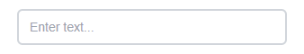 _Text input with label_

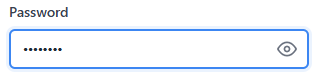 _Password with toggle visibility_

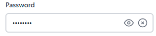 _Input with clear button_

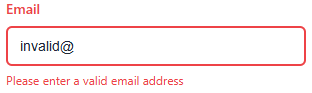 _Error state with validation message_

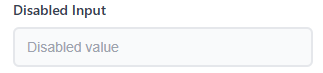 _Disabled state_

### Toast Component Types

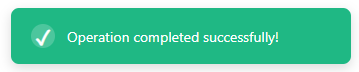 _Success notification_

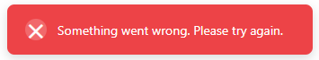 _Error notification_

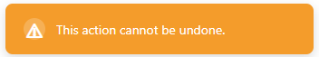 _Warning notification_

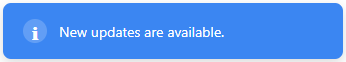 _Info notification_

### SidebarMenu Component States

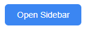 _Sidebar hidden_

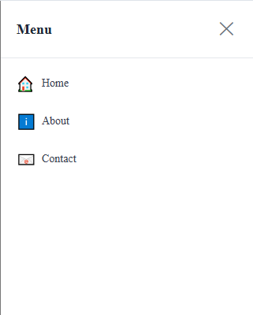 _Basic menu open_

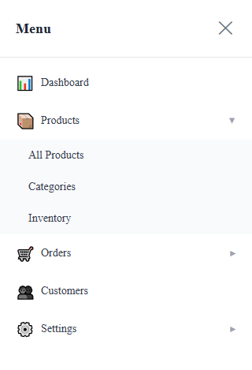 _Nested menu expanded_

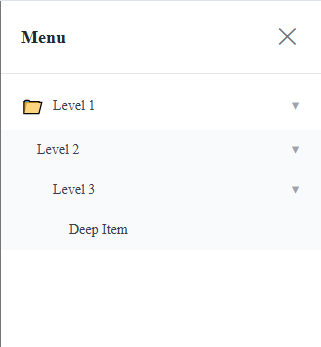 _Deep nested menu expanded_

## 🛠️ Tech Stack

- React 18
- TypeScript
- Storybook 7
- CSS Modules
- Vite

## 📁 Structure

```
src/
├── components/
│   ├── Input/
│   │   ├── Input.tsx
│   │   ├── Input.module.css
│   │   └── index.ts
│   ├── Toast/
│   │   ├── Toast.tsx
│   │   ├── Toast.module.css
│   │   └── index.ts
│   └── SidebarMenu/
│       ├── SidebarMenu.tsx
│       ├── SidebarMenu.module.css
│       └── index.ts
└── stories/
    ├── Input.stories.tsx
    ├── Toast.stories.tsx
    └── SidebarMenu.stories.tsx
```

## ✨ Features

- 🎯 TypeScript support
- 📱 Responsive design
- ♿ Accessible (ARIA)
- 🎭 Smooth animations
- 📚 Storybook docs

## 📄 License

MIT
